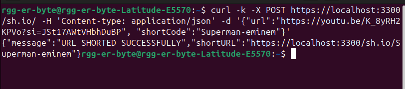

# URL Shortener
This is a simple backend service that allows users to shorten URLs. This repo serves as a solution to [Roadmap.sh URL Shortening Service ](https://roadmap.sh/projects/url-shortening-service)
--
## Featrures

-Shorten urls into shortcodes
-Shortcodes can be customizables
-Redirects to the original url from the short url
-Basic error handling
-Basic statics of the urls
-Basic validation of urls and shortcodes
--
## Tech Stack
-Node js
-Javascript
-Mysql
-html
-validator
--
## Installation
   1. Clon this repo
      ```bash
      git clone https://github.com/your-username/url-shortener.git
      cd url-shortener
      ```
   2. Install depedencies
      ```npm
      npm install mysql2 validator express nodemon
      ```
   3. Set up enviroment variables
      ``` .env
      PORT = 3300
      DB_USER = ???
      DB_PWD = ???
      DB_HOST = ???
      DB_NAME = ???
      HOST = localhost
      ```
   4. Start the server
         ``` bash
         node app.js
         ```
         In case of use https need to generate a certificate.
         Also can use nodemon to run it and see changes in real time
         ```nodemon
         npx nodemon app.js
         ```
---
## End points
  1. *POST /sh.io/*
    Create a link with a custom short code or dont.
     ### Request
        ####Headers
        ```      
              Content-type: application/json
        ```
        #### Body
        ```    
            {
              url: //url to shorten
              shortCode: //custom shortcode
            }
        ```
        #### Response
        ```    
            {
              message: URL SHORTED SUCCESSFULLY,
              shortURL: // Url shorten
            }
        ```
        #### Example 
        
